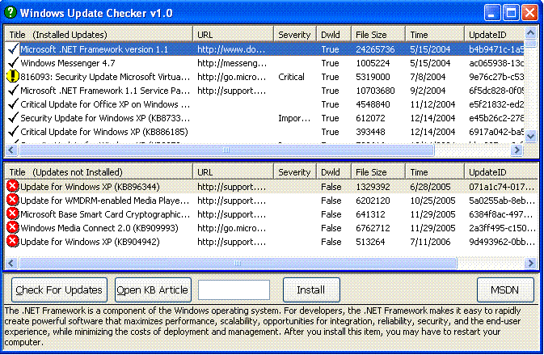



## Windows Update Checker

### Description

This is a Windows Update Checker. It will tell you all installed Windows Updates on

your PC, and also which ones have not been installed. It also provides very usefull

information about each update, all obtained from the Windows Update Servers.

This program uses the Windows Update Agent (WUA) API, which is a set

of COM Interfaces that enable you to access Windows Update and Windows

Server Update Services (WSUS).

This program will only run on Windows 2000 SP3+, XP, 2003 and Vista.

This program is not compatable with Windows 9x/Me/NT.
 
### More Info
 

             |
---                |---
**Submitted On**   |2006-08-01 10:28:02
**By**             |[Snerf](https://github.com/Planet-Source-Code/PSCIndex/blob/master/ByAuthor/snerf.md)
**Level**          |Intermediate
**User Rating**    |4.7 (14 globes from 3 users)
**Compatibility**  |VB 6\.0
**Category**       |[Complete Applications](https://github.com/Planet-Source-Code/PSCIndex/blob/master/ByCategory/complete-applications__1-27.md)
**World**          |[Visual Basic](https://github.com/Planet-Source-Code/PSCIndex/blob/master/ByWorld/visual-basic.md)
**Archive File**   |[Windows\_Up201029812006\.zip](https://github.com/Planet-Source-Code/snerf-windows-update-checker__1-66157/archive/master.zip)

